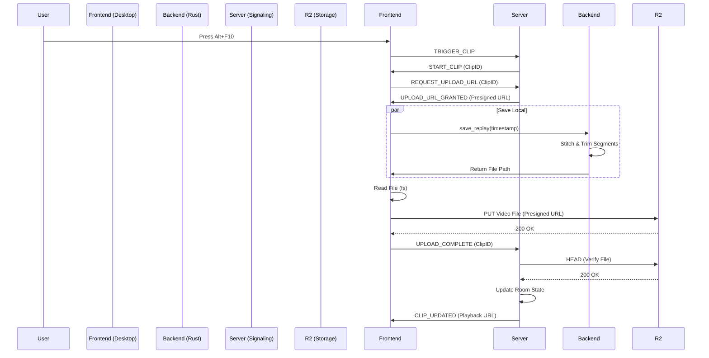

# File Operations Architecture Report

## Overview

This report details the end-to-end architecture for recording, metadata extraction, saving, uploading, and synchronizing video clips within the Squad Sync application. The system uses a hybrid approach with a Rust backend for heavy media processing (FFmpeg) and a TypeScript frontend for coordination and network operations.

## 1. Recording (Backend)

**Location**: `apps/desktop/src-tauri/src/ffmpeg/process.rs`

The recording process is managed by the Rust backend using FFmpeg. It operates as a continuous "replay buffer".

- **Process**: A `RecordingSession` spawns a persistent FFmpeg process.
- **Storage**: Video and audio are recorded into short segments (e.g., `video_20251201100000.mkv`) stored in a temporary buffer directory.
- **Circular Buffer**: The system implements a circular buffer by monitoring the directory and deleting segments older than the configured retention period (e.g., 120 seconds).
- **Separation**: Video and audio are often recorded to separate files to allow for different input sources (e.g., System Audio vs. Microphone) and are stitched later.

## 2. Metadata Extraction

**Location**: `apps/desktop/src-tauri/src/commands/replay.rs` & `apps/signaling/src/server.ts`

Metadata is gathered at multiple stages:

- **Timestamps**:
  - **Coarse**: Embedded in the segment filenames (`video_%Y%m%d%H%M%S.mkv`).
  - **Precise**: During the save process, `ffprobe` is used to determine the exact start time of the first segment to calculate frame-perfect trim offsets.
- **Clip Identity**:
  - **Clip ID**: Generated by the Signaling Server (UUID) when a clip is triggered.
  - **User ID**: Associated with the WebSocket connection on the Signaling Server.
- **File Metadata**: Standard MP4 metadata is written by FFmpeg during the merge/save process.

## 3. Saving (Backend)

**Location**: `apps/desktop/src-tauri/src/commands/replay.rs`

When a clip is triggered (e.g., via `Alt+F10` or remote signal), the `save_replay` command is executed:

1.  **Time Calculation**: The system calculates the start and end time based on the trigger timestamp and the configured buffer duration (e.g., last 60 seconds).
2.  **Segment Selection**: It scans the buffer directory for all segments that overlap with the requested time range.
3.  **Stitching**: Selected segments are concatenated using the FFmpeg `concat` demuxer.
4.  **Trimming**: The stitched video is trimmed (`-ss` and `-t`) to the exact requested duration.
5.  **Output**: The final file is saved as `Replay_YYYY-MM-DD_HH-MM-SS.mp4` in the user's video directory (e.g., `Videos/SquadSync`).
6.  **Return**: The absolute file path of the saved video is returned to the frontend.

## 4. Uploading (Frontend)

**Location**: `apps/desktop/src/hooks/useRecorder.ts` & `apps/desktop/src/components/room/RoomManager.tsx`

Uploads are handled entirely by the frontend to leverage the browser's network stack and simplify authentication.

1.  **Request URL**: When a clip starts, the client sends `REQUEST_UPLOAD_URL` to the Signaling Server.
2.  **Presigned URL**: The server generates a temporary AWS S3/R2 Presigned PUT URL and returns it via `UPLOAD_URL_GRANTED`.
3.  **File Read**: The frontend uses `@tauri-apps/plugin-fs` to read the saved `.mp4` file from the disk.
4.  **Upload**: The file content is uploaded directly to the R2 bucket using a standard HTTP `PUT` request to the presigned URL.
5.  **Completion**: Upon success, the `RoomManager` component sends an `UPLOAD_COMPLETE` message to the server.

## 5. Synchronization (Signaling Server)

**Location**: `apps/signaling/src/server.ts`

The Signaling Server (PartyKit) coordinates the state between all clients in a room.

1.  **Trigger**: A client sends `TRIGGER_CLIP`. The server broadcasts `START_CLIP` to all users, causing them to capture their local buffers simultaneously.
2.  **Verification**: When the server receives `UPLOAD_COMPLETE` from a client, it performs a `HEAD` request to the R2 bucket to verify the file exists and is accessible.
3.  **State Update**:
    - The server updates the room's persistent storage with the new clip metadata.
    - It records the "View" (playback URL) for that specific user.
4.  **Broadcast**: The server broadcasts `CLIP_UPDATED` to all connected clients.
5.  **Playback**: Clients receive the update and can immediately play the clip using the provided R2 URL.

## 6. Web-Side Synchronization & Playback

**Location**: `apps/web/src/app/room/[roomId]/RoomClient.tsx` & `apps/web/src/components/WebSquadGrid.tsx`

The web application serves as the playback interface, allowing users to watch synchronized clips from multiple perspectives.

1.  **Connection**:
    - The client uses `PartySocket` to connect to the Signaling Server.
    - It listens for real-time updates: `CLIP_LIST` (initial load), `START_CLIP` (new recording started), and `CLIP_UPDATED` (new view available).

2.  **State Management**:
    - `RoomClient` maintains the state of all clips and their associated views (uploads from different users).
    - It transforms this hierarchical data (Clip -> Views) into a flat list of playable `WebClip` objects for the grid layout.

3.  **Playback Sync**:
    - **Leader Strategy**: The `WebSquadGrid` component uses a "leader" approach where the first video in the grid drives the global timeline (current time and duration).
    - **Global Controls**: Play, Pause, and Seek actions are intercepted by React state and applied to _all_ video elements simultaneously via refs.
    - **Seek Sync**: When the user scrubs the timeline, the `currentTime` is updated on every video element to ensure they jump to the same frame.
    - **Offset Handling**: The architecture supports an `offsetMs` property to handle slight start-time differences, though currently, the system relies on the precise trimming performed by the backend to ensure files start at the same relative timestamp.

## Diagram

